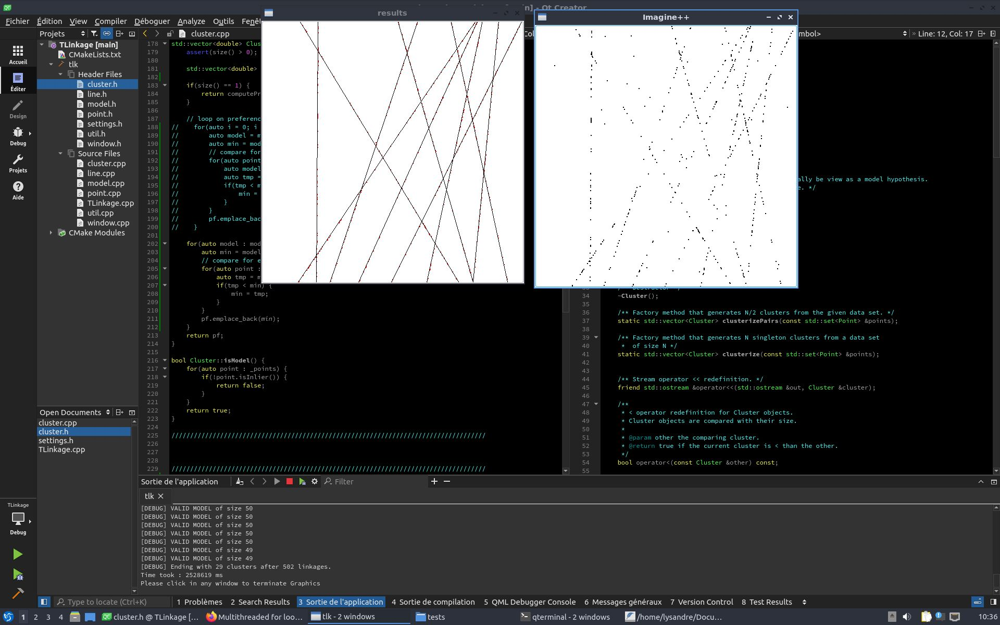

# J-Linkage

## Overview

Implementation of the J-Linkage algorithm for multiple line fitting problems, based on R. Toldo & A. Fusiello work [[1]](#references).




## Install & use

### Compile

This program is coded using C++, its compilation requires :
- the cmake utilities (>= v3.4)
- the Imagine++ library (download at [http://imagine.enpc.fr/~monasse/Imagine++/](http://imagine.enpc.fr/~monasse/Imagine++/))


Clone repository :

```
git clone https://github.com/Lys-san/T-Linkage.git
```

Build Makefile :

```
cmake CMakeLists.txt
```

and then the executable :
```
make
``` 

The generated executable file is `tlk.exe`.

### program

This program uses randomly generated datasets for line fitting problems. Depending on the size of the dataset, computation may take some time.

The main files of this programm are `TLinkage.cpp` and `settings.h`. 

`TLinkage.cpp` contains the main function with TLinkage algorithm.

`settings.h` defines the global parameters to use for testing (threshold, number of inliers/outliers etc...) that you may want to modify.

Other files define classes and functions used in `TLinkage.cpp`.


For any information, please contact me at lysandre.macke@enpc.fr

## References
[1] Luca Magri and Andrea Fusiello. 
T-linkage: A continuous relaxation of j-linkage for multi-model fitting. CVPR 2014.
