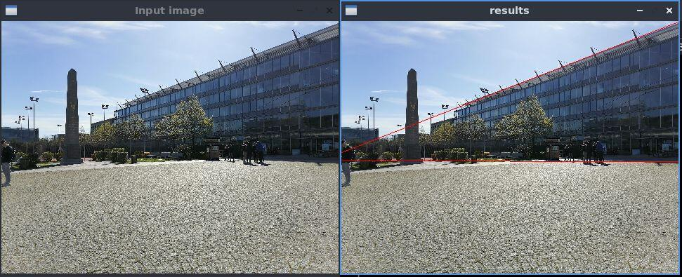

# T-Linkage

## Overview

Implementation of the T-Linkage algorithm for multiple line fitting problems, based on L. Magri & A. Fusiello work [[1]](#references).


## Install


This program is coded using C++, its compilation requires :
- the cmake utilities (>= v3.4)
- the Imagine++ library (download at [http://imagine.enpc.fr/~monasse/Imagine++/](http://imagine.enpc.fr/~monasse/Imagine++/))


Clone repository :

```
git clone https://github.com/Lys-san/T-Linkage.git
```

Build Makefile :

```
cmake CMakeLists.txt
```

and then the executable :
```
make
``` 

The generated executable file is `tlk.exe`.

## Usage

The demo.cpp file proposes 2 available modes : 
- Multiple line detection from a randomly generated data set
- Multiple line detection from an input image.

### Multiple line detection from a randomly generated data set


command : `./tlk`

The file include/settings.h contains global parameters (number of inliers and outliers, noise, threshold etc...) that you may want to modify.

Note that depending on the size of the generated data set, computation may take some time.


### Multiple line detection fom an input image




command : `./tlk image.jpg`

Where image.jpg is your input image (format can be JPEG, PNG, TIFF and more). Some example images can be found in the input folder.

Please note that complex images containg really noisy parts (like tree leaves or complex patterns) may not show good results.

The file include/settings.h contains global parameters (threshold for image contouring, data set extraction filter value, etc...) that you may want to modify.


For any more information, please contact me at lysandre.macke@enpc.fr

## References
[1] Luca Magri and Andrea Fusiello. 
T-linkage: A continuous relaxation of j-linkage for multi-model fitting. CVPR 2014.
